# Giới thiệu
Stereo Matching là một bài toán lớn trong lĩnh vực Thị giác máy tính (Computer Vision), với mục tiêu phục hồi kiến trúc 3D thực tế từ một cặp ảnh 2D, gọi là ảnh stereo. Stereo Matching thường được ứng dụng trong các ứng dụng liên quan đến Xe tự hành (Autonomous Driving),
Thực tế ảo (Augmented Reality)...

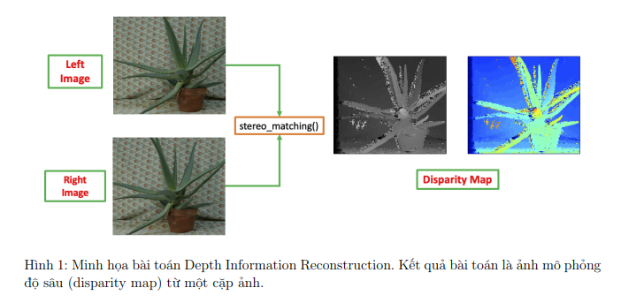

## Background
Mắt con người khi nhìn một sự vật hay hiện tượng có thể nhận ra được khoảng cách gần xa (chiều sâu của vật). Ta có thể tưởng tượng mỗi con mắt giống như một camera, và não dựa vào hình ảnh từ 2 mắt để cảm nhận (tính toán) được độ sâu. Vậy liệu máy tính có thể làm được việc tương tự?

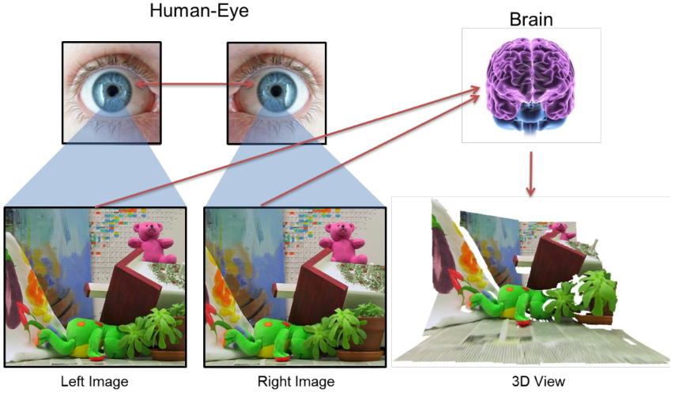

## Stereo camera
Ứng dụng cơ chế hoạt động của mắt người, người ta sử dụng stereo camera gồm 2 camera bên phải và bên trái giống như 2 con mắt của con người. Và dựa trên thông tin của 2 hình ta sẽ đi tính chiều sâu của mỗi pixel trong khung hình (disparity map).

Cấu tạo:
* O và O' tương ứng với 2 vị trí đặt camera
* Baseline B là khoảng cách giữa 2 camera
* Focal length (tiêu cự) f:  khoảng cách giứa trung tâm của con mắt camera tới sensor ghi nhận hình ảnh

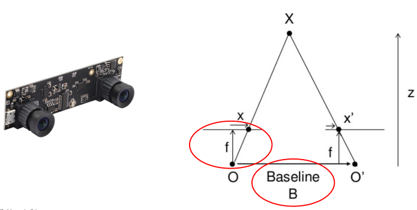

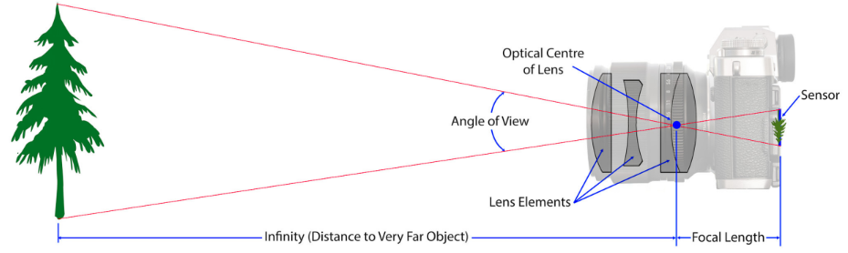

Và bài toán Stereo matching là từ 2 ảnh của 2 camera, với các thông số baseline B và focal length f, ta sẽ đi xây dựng Disparity map thể hiện chiều sâu của mỗi điểm ảnh trong khung hình.

## Thách thức
Camera khi đặt trong điều kiện tiêu chuẩn như trong phòng lab (có đầy đủ ánh sáng, sự ổn định không bị rung lắc, ...) thì thuật toán Stereo matching khá hoàn hảo và cho kết quả tương đối chính xác. 

Tuy nhiên môi trường thực tế không thể hoàn hảo như vậy. Như trường hợp xe tự hành, có thể do mặt trời chiếu từ một phía làm cho độ sáng của một camera khác nhiều so với camera kia làm cho nội dung của 2 hình ảnh không quá giống nhau khi đem so sánh với nhau. Và trường hợp này Disparity result sẽ không được tốt (như hình SAD). 

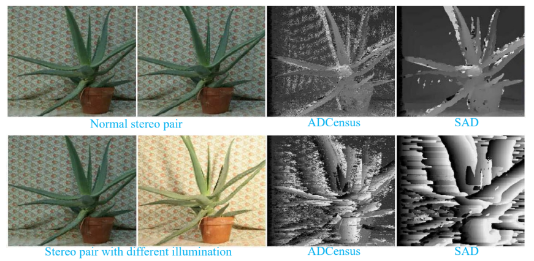

Trong thực tế khi điều kiện chiếu sáng không hoàn hảo thì kết quả cũng không được tốt, như: khi trời tối và nhiều đèn đường, đèn xe khác chiếu sáng khiến cho điều kiện chiếu sáng không tốt; trời mưa; trời có sương mù. Với mối điều kiện như vậy lại cần một thuật toán tốt hơn để giải quyết vấn đề.
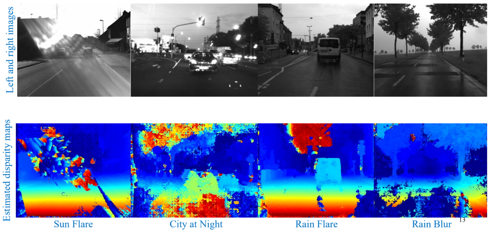

# Stereo matching pipeline
Đây là một pipeline tổng quát cho bài toán Stereo Matching
1. **Pre-processing**: tiền xử lý ảnh như khử nhiễu, điều chỉnh độ sáng tối của ảnh
2. **Stereo image rectification**: thuật toán điều chỉnh để cho khoảng cách từ 2 camera tới vật thể gần nhau để cho 2 bức ảnh được chuẩn hóa và làm cho thuật toán maching trở lên chính xác hơn
3. **Stereo matching computation**: bài toán hiện tại để xây dựng lên Disparity map.
4. **Disparity estimation**: bước hậu xử lý để cho Disparity map tốt nhất có thể
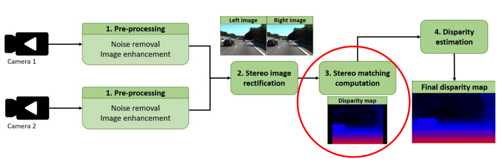

# Stereo matching computation
* **Disparity map** - một ma trận mà mỗi giá trị trong ma trận biểu diễn sự chênh lệch về giá trị giữa pixel của ảnh bên phải với giá trị pixel tại vị trí tương ứng trong ảnh bên trái để mô phỏng chiều sâu của pixel đó.

Project này implement 2 thuật toán matching: pixel-wise matching và window-based mathcing

## Pixel-wise matching
Xét một pixel p bất kỳ bên hình trái, là một pixel có tọa độ (x,y). Ta sẽ đi tìm một số d sao cho giá trị $C_1(p,d) = |L(p) - R(p-d)|$ là nhỏ nhất. Trong đó:
* L là hình trái
* R là hình phải
* $L(p)$ là (vector) giá trị của p 

Khi đó d là giá trị của pixel p trong disparity map.

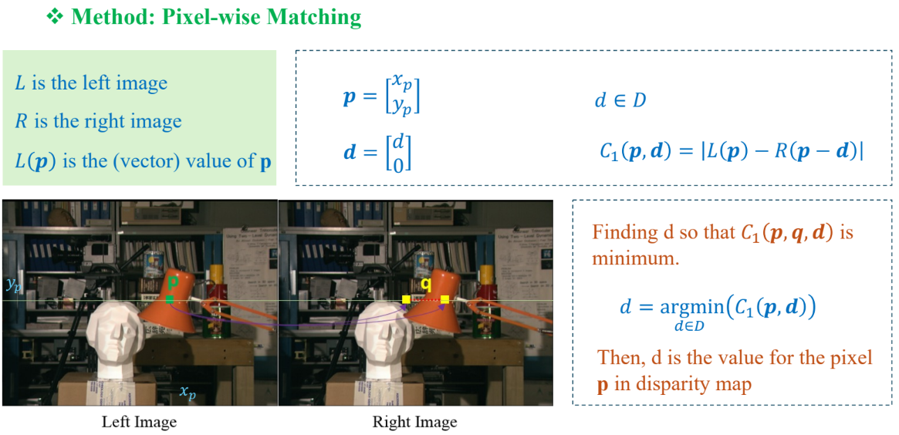

## Window-based matching
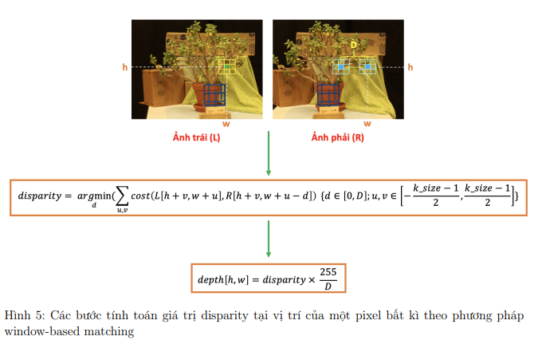

Trong khi sử dụng phương pháp pixel-wise matching ta đánh giá disparity value dựa vào giá trị của một pixel, đơn vị pixel nhỏ (ít thông tin hơn) dẫn tới đánh giá disparity không đủ tốt. Vì vậy thay vì đánh giá dựa vào giá trị của 1 pixel thì phương pháp window-based cho phép đánh giá một vùng xung quanh giá trị pixel đó. Thông tin nhiều hơn dẫn tới đánh giá dựa vào window-based cho kết quả tốt hơn.

## Limitation
Khi hai ảnh có độ sáng tối khác nhau (biến đổi tuyến tính) thì kết quả sẽ không tốt khi dùng cách tính khoảng cách L1 hoặc L2. Như với hai hình trái-phải dưới đây, khi áp dụng window-based matching với disparity range = 64, kernel size = 5

* Input

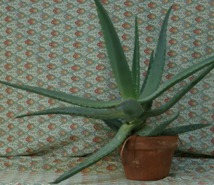
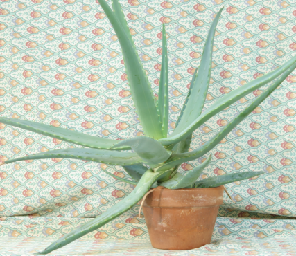

* Output

- Kết quả khi dùng L1 cost
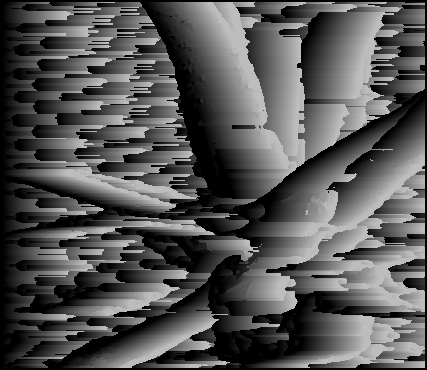

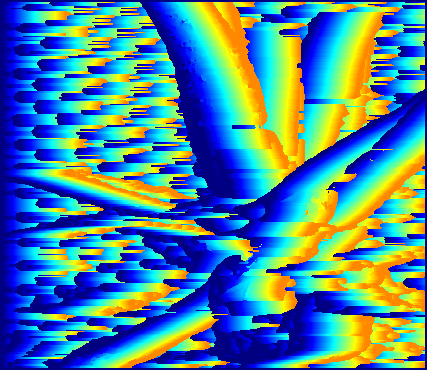

** Kết quả khi dùng cosine similarity cost
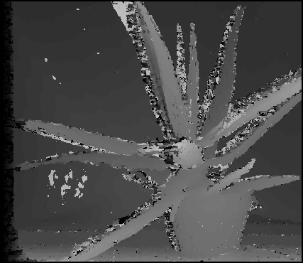

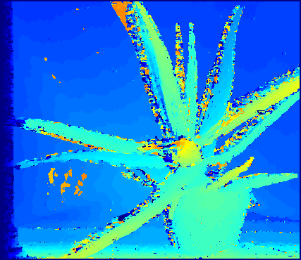

# Setup development environment
1. Install `virtualenv` package that support to create virtual enviroment (if not install yet):
>pip install virtualenv

2. Create virtual environment named `env`
>py -m venv env

3. Activate the virtual environment
>Set-ExecutionPolicy Unrestricted -Scope Process    # run this command if get error UnauthorizedAccess when activating
>env\Scripts\activate

4. Install packages defined in requirements.txt
>pip install -r requirements.txt

5. Deactivate the virtual environment when finish
>deactivate